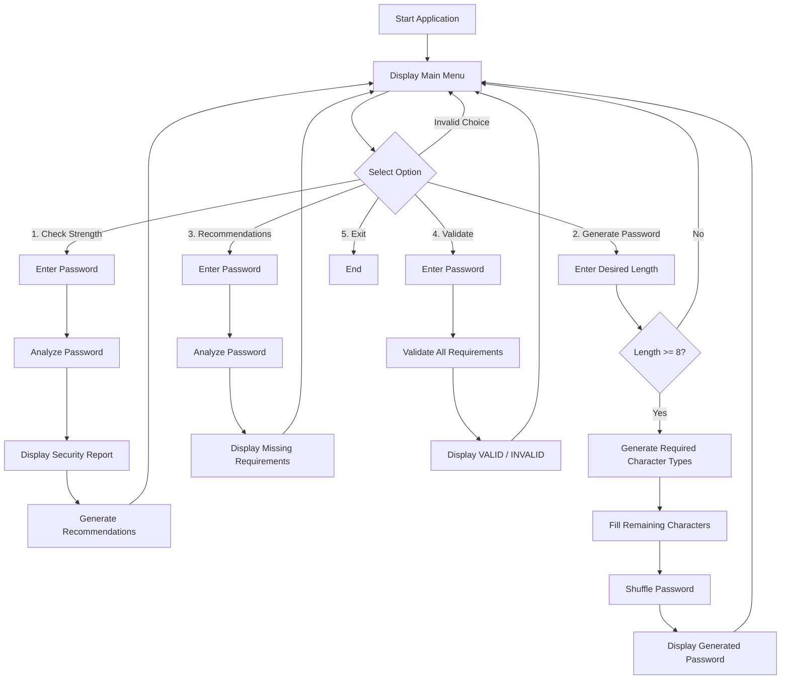
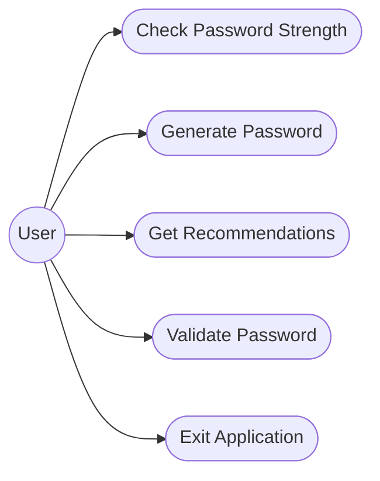
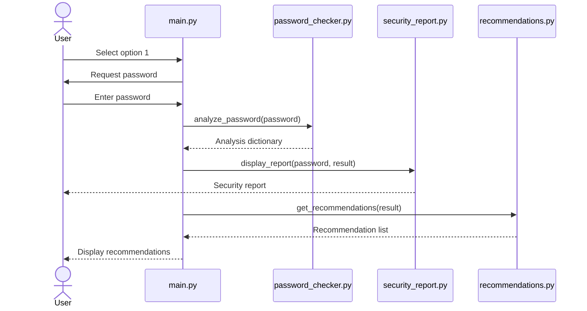

# Password Security Tool

## 1. Project Title

**Password Security Tool**

A modular Python application that analyzes password strength, generates
passwords, provides security recommendations, and validates passwords
against a set of basic security requirements.

------------------------------------------------------------------------

## 2. Project Overview

The **Password Security Tool** is a command-line Python project designed
to address a common problem: users often create passwords without
checking whether they contain enough characters, different character
types, or other basic security characteristics.

The project provides four core operations:

1.  **Check Password Strength** -- analyzes a password against five
    basic criteria and calculates a score out of 5.
2.  **Generate Password** -- creates a random password containing
    uppercase letters, lowercase letters, digits, and special
    characters.
3.  **Get Recommendations** -- identifies which password requirements
    are missing and suggests improvements.
4.  **Validate Password** -- checks whether a password satisfies all
    required criteria.

The project follows a modular design in which password analysis,
generation, recommendations, validation, reporting, and user interaction
are separated into different modules.

------------------------------------------------------------------------

## 3. Problem Statement

Many users choose passwords without checking basic security
characteristics such as length and the presence of uppercase letters,
lowercase letters, digits, and special characters. This can result in
weak passwords.

The objective of this project is to develop a simple and modular
command-line tool that can:

-   Analyze password characteristics.
-   Assign a password-strength level.
-   Generate passwords meeting minimum requirements.
-   Provide recommendations for improving passwords.
-   Validate passwords against defined rules.
-   Present the results in a clear report.

------------------------------------------------------------------------

## 4. Objectives

The main objectives are:

-   To apply Python programming concepts to a practical problem.
-   To use functions and modular programming.
-   To perform input validation and error handling.
-   To use string processing and built-in string methods.
-   To use conditional statements and loops.
-   To use the `random` and `string` modules.
-   To separate application logic into reusable modules.
-   To provide clear output and recommendations to the user.
-   To demonstrate a maintainable project/folder structure.

------------------------------------------------------------------------

## 5. Scope of the Project

### In Scope

-   Password length checking.
-   Uppercase-character checking.
-   Lowercase-character checking.
-   Digit checking.
-   Special-character checking.
-   Password strength scoring from 0 to 5.
-   Strength categories: WEAK, MEDIUM, STRONG, and VERY STRONG.
-   Random password generation.
-   Password recommendations.
-   Password validation.
-   Command-line reporting.
-   Basic input/error handling.

### Out of Scope

The current version does not:

-   Store passwords in a database.
-   Send passwords over a network.
-   Check passwords against known leaked-password databases.
-   Estimate resistance against a specific cracking algorithm.
-   Implement multi-factor authentication.
-   Manage user accounts.

------------------------------------------------------------------------

## 6. Target Users

The intended users are:

-   Students learning Python programming.
-   Beginners learning modular programming.
-   Users who want a basic local password-checking utility.
-   Developers demonstrating functions, modules, validation, and random
    generation.

------------------------------------------------------------------------

## 7. Functional Requirements

The project contains more than the minimum three major functional
modules required for the project.

  --------------------------------------------------------------------------------
  ID             Functional        Input          Processing     Output
                 Requirement                                     
  -------------- ----------------- -------------- -------------- -----------------
  FR1            Check password    Password       Analyze five   Security report
                 strength                         criteria and   and strength
                                                  calculate      
                                                  score          

  FR2            Generate password Desired length Generate and   Random password
                                                  shuffle        
                                                  characters     

  FR3            Get               Password       Identify       List of
                 recommendations                  missing        recommendations
                                                  criteria       

  FR4            Validate password Password       Check all      VALID / INVALID
                                                  mandatory      
                                                  criteria       

  FR5            Display security  Password +     Format         Detailed report
                 report            analysis       analysis       
                                   result         results        

  FR6            Menu-based        User choice    Route choice   Selected
                 interaction                      to appropriate operation
                                                  function    
                                                  
  --------------------------------------------------------------------------------

### Password Analysis Rules

A password receives one point for each satisfied criterion:

1.  Length is at least 8 characters.
2.  Contains an uppercase letter.
3.  Contains a lowercase letter.
4.  Contains a digit.
5.  Contains a special character.

### Strength Classification

    Score Strength
  ------- -------------
     0--2 WEAK
        3 MEDIUM
        4 STRONG
        5 VERY STRONG

------------------------------------------------------------------------

## 8. Non-Functional Requirements

The project addresses the following non-functional requirements.

### 8.1 Usability

-   The application provides a simple numbered menu.
-   Output is presented using clear labels.
-   Passwords entered for reports are masked with `*`.

### 8.2 Maintainability

-   The project is divided into separate Python modules.
-   Functions have focused responsibilities.
-   Password analysis results are returned as a dictionary so different
    modules can reuse them.

### 8.3 Reliability

-   Empty password input is handled.
-   Invalid numeric input for password generation is handled using
    `try/except`.
-   Password validation returns a clear Boolean result.

### 8.4 Security

-   Entered passwords are not displayed directly in the security report.
-   The current program does not persist passwords.
-   Generated passwords use Python's `random` module for this
    educational project.

> For production-grade credential generation, a cryptographically secure
> random source such as Python's `secrets` module would be preferable.

### 8.5 Resource Efficiency

-   Password analysis uses simple character scans.
-   No external database or network service is required.
-   The application runs locally through the Python interpreter.

### 8.6 Error Handling

-   Empty password input is rejected.
-   Non-numeric password length input is caught.
-   Password lengths below the required minimum are rejected by the main
    interface.

------------------------------------------------------------------------

## 9. Technologies and Tools Used

-   **Programming Language:** Python 3.14.6
-   **Standard Libraries:** `random`, `string`
-   **Programming Concepts:** Functions, modules, conditionals, loops,
    lists, dictionaries, string methods, Boolean expressions, exception
    handling
-   **Interface:** Command-line interface (CLI)
-   **Version Control:** Git / GitHub
-   **Documentation:** Markdown (`README.md` and `statement.md`)

No external Python packages are required for the application.

------------------------------------------------------------------------

## 10. Project Architecture

The application follows a modular architecture.

``` text
                         +----------------------+
                         |      main.py         |
                         |  User Interface/Menu |
                         +----------+-----------+
                                    |
              +---------------------+----------------------+
              |                     |                      |
              v                     v                      v
   +------------------+   +------------------+   +-------------------+
   | password_checker |   | password_generator|   | recommendations   |
   | Password Analysis|   | Password Creation |   | Security Advice   |
   +--------+---------+   +------------------+   +-------------------+
            |
            v
   +------------------+
   | security_report  |
   | Report Display   |
   +------------------+

                         +------------------+
                         | password_validator|
                         | Validation Logic  |
                         +------------------+
```

### Main Components

  -----------------------------------------------------------------------
  Module                              Responsibility
  ----------------------------------- -----------------------------------
  `main.py`                           Menu, user interaction, and
                                      application flow

  `password_checker.py`               Analyzes password characteristics
                                      and calculates score

  `password_generator.py`             Generates random passwords

  `recommendations.py`                Generates improvement
                                      recommendations

  `password_validator.py`             Validates passwords against all
                                      required rules

  `security_report.py`                Displays formatted password
                                      security reports
  -----------------------------------------------------------------------

This gives the project six meaningful Python files, satisfying the
project guideline for a modular coding project requiring approximately
5--10 meaningful modules/classes/files.

------------------------------------------------------------------------

## 11. Workflow



------------------------------------------------------------------------

## 12. Use Case Diagram



------------------------------------------------------------------------

## 13. Component/Class-Level Design

The project is function-based rather than class-based, so a
component/module diagram is more appropriate than a traditional class
diagram.

``` mermaid
flowchart TD
    MAIN[main.py]

    CHECK[password_checker.py<br/>analyze_password()]
    GEN[password_generator.py<br/>generate_password()]
    REC[recommendations.py<br/>get_recommendations()]
    VAL[password_validator.py<br/>validate_password()]
    REPORT[security_report.py<br/>display_report()]

    MAIN --> CHECK
    MAIN --> GEN
    MAIN --> REC
    MAIN --> VAL
    MAIN --> REPORT

    CHECK --> REC
    CHECK --> REPORT
```

------------------------------------------------------------------------

## 14. Sequence Diagram

### Password Strength Check



------------------------------------------------------------------------

## 15. Storage / Database Design

The current project **does not use persistent storage or a database**.

No passwords are stored in:

-   SQL databases
-   Files
-   Cloud storage
-   External APIs

Therefore, an ER diagram is not applicable to the current
implementation.

------------------------------------------------------------------------

## 16. Detailed Module Description

### `password_checker.py`

Contains:

``` python
def analyze_password(password):
```

Responsibilities:

-   Checks password length.
-   Checks uppercase characters.
-   Checks lowercase characters.
-   Checks digits.
-   Checks special characters.
-   Calculates the score.
-   Assigns a strength category.
-   Returns all results in a dictionary.

Example result structure:

``` python
{
    "length": True,
    "uppercase": True,
    "lowercase": True,
    "digit": True,
    "special": True,
    "score": 5,
    "strength": "VERY STRONG"
}
```

### `password_generator.py`

Contains:

``` python
def generate_password(length=12):
```

Responsibilities:

-   Selects at least one uppercase letter.
-   Selects at least one lowercase letter.
-   Selects at least one digit.
-   Selects at least one special character.
-   Fills the remaining positions.
-   Shuffles the resulting characters.
-   Returns the generated password.

### `recommendations.py`

Contains:

``` python
def get_recommendations(result):
```

Responsibilities:

-   Checks which requirements are missing.
-   Creates user-friendly recommendations.
-   Returns the recommendations as a list.

### `password_validator.py`

Contains:

``` python
def validate_password(password):
```

Responsibilities:

-   Checks all five mandatory conditions.
-   Returns `True` when every condition is satisfied.
-   Returns `False` otherwise.

### `security_report.py`

Contains:

``` python
def display_report(password, result):
```

Responsibilities:

-   Displays a formatted report.
-   Masks the entered password.
-   Shows PASS/FAIL for each criterion.
-   Shows score and strength.

### `main.py`

Contains:

``` python
def check_password()
def create_password()
def show_recommendations()
def validate()
def main()
```

Responsibilities:

-   Controls the user interface.
-   Reads user input.
-   Calls the appropriate module.
-   Handles invalid menu choices.
-   Handles invalid numeric input.
-   Runs the main loop.

------------------------------------------------------------------------

## 17. Installation

### Prerequisites

Install:

-   Python 3.14.6
-   Git 

Check Python installation:

``` bash
python --version
```

or:

``` bash
python3.14.6 --version
```

### Clone the Repository

``` bash
git clone <YOUR_GITHUB_REPOSITORY_URL>
cd <YOUR_PROJECT_FOLDER>
```

### Dependencies

The application uses only Python standard libraries, so no `pip install`
command is required.

------------------------------------------------------------------------

## 18. Recommended Project Structure

``` text
Password-Security-Tool/
│
├── main.py
├── password_checker.py
├── password_generator.py
├── recommendations.py
├── password_validator.py
├── security_report.py
├── README.md
├── statement.md
├── tests/
│   └── test_password_tool.py
└── screenshots/
    ├── check_password.png
    ├── generate_password.png
    └── validation.png
```

The screenshots and test file are recommended additions for the final
GitHub submission.

------------------------------------------------------------------------

## 19. How to Run

From the project directory:

``` bash
python main.py
```

The application displays:

``` text
===================================
      PASSWORD SECURITY TOOL
===================================
1. Check Password Strength
2. Generate Password
3. Get Recommendations
4. Validate Password
5. Exit
Enter your choice:
```

Select an option by entering `1`, `2`, `3`, `4`, or `5`.

------------------------------------------------------------------------

## 20. Testing Instructions

Testing should cover normal inputs, boundary cases, and invalid inputs.

### Test Case 1 -- Weak Password

**Input:**

``` text
abc
```

**Expected result:**

-   Length: FAIL
-   Uppercase: FAIL
-   Lowercase: PASS
-   Digit: FAIL
-   Special character: FAIL
-   Score: 1/5
-   Strength: WEAK

### Test Case 2 -- Medium Password

**Input:**

``` text
Abcdefgh
```

**Expected result:**

-   Length: PASS
-   Uppercase: PASS
-   Lowercase: PASS
-   Digit: FAIL
-   Special character: FAIL
-   Score: 3/5
-   Strength: MEDIUM

### Test Case 3 -- Strong Password

**Input:**

``` text
Abcdef12
```

**Expected result:**

-   Length: PASS
-   Uppercase: PASS
-   Lowercase: PASS
-   Digit: PASS
-   Special character: FAIL
-   Score: 4/5
-   Strength: STRONG

### Test Case 4 -- Very Strong According to Program Rules

**Input:**

``` text
Abcdef12!
```

**Expected result:**

-   All five requirements PASS.
-   Score: 5/5.
-   Strength: VERY STRONG.

### Test Case 5 -- Invalid Generator Length

**Input:**

``` text
7
```

**Expected result:**

``` text
Length must be at least 8.
```

### Test Case 6 -- Invalid Numeric Input

**Input:**

``` text
abc
```

for password length.

**Expected result:**

``` text
Please enter a valid number.
```

### Test Case 7 -- Empty Password

**Input:**

``` text
<empty>
```

**Expected result:**

``` text
Password cannot be empty.
```

------------------------------------------------------------------------

## 21. Testing Strategy

Testing is based on functional validation of each module and integration
testing through the main menu.

### Unit-Level Testing

Test individual functions such as:

-   `analyze_password()`
-   `generate_password()`
-   `get_recommendations()`
-   `validate_password()`

### Integration Testing

Verify that:

-   `main.py` correctly calls the analysis module.
-   Analysis results can be passed to the report module.
-   Recommendations correctly use analysis results.
-   Generated passwords can be analyzed and validated.

### Boundary Testing

Important boundaries include:

-   Password length of 7.
-   Password length of exactly 8.
-   Empty input.
-   Score values from 0 through 5.
-   Invalid numeric input.

------------------------------------------------------------------------

## 22. Design Decisions and Rationale

### Modular Design

Separate files were selected so that each module has a clear
responsibility. This makes the project easier to understand, test,
maintain, and extend.

### Dictionary for Analysis Results

A dictionary is used to return related password-analysis values with
meaningful keys such as `"uppercase"` and `"score"`. This makes the
result easy for the reporting and recommendation modules to consume.

### Boolean Criteria

Each password requirement is represented by a Boolean value (`True` or
`False`). The score is calculated from these criteria.

### Standard Library Only

The project uses Python's built-in `random` and `string` modules so that
the application remains simple to install and run.

### Command-Line Interface

A CLI was selected because it demonstrates Python programming
fundamentals without requiring a graphical framework.

------------------------------------------------------------------------

## 23. Implementation Quality

The implementation demonstrates:

-   Functions with specific responsibilities.
-   Modular file organization.
-   Conditional statements.
-   `for` loops and `while` loops.
-   Lists and dictionaries.
-   String methods such as `isupper()`, `islower()`, `isdigit()`, and
    `isalnum()`.
-   The `any()` function.
-   Exception handling with `try/except`.
-   Random character generation.
-   Random shuffling.
-   Reusable analysis results.

------------------------------------------------------------------------

## 24. Challenges Faced

Potential implementation challenges addressed by the project include:

1.  Checking multiple password conditions independently.
2.  Combining Boolean conditions into a numerical score.
3.  Generating a password that contains all required character
    categories.
4.  Keeping generated characters within the requested length.
5.  Providing useful recommendations based on missing requirements.
6.  Separating application logic into multiple modules.
7.  Handling invalid user input without terminating the application
    unexpectedly.

------------------------------------------------------------------------

## 25. Learnings and Key Takeaways

Through this project, the following concepts can be demonstrated:

-   Python functions and function parameters.
-   Return values.
-   Modular programming.
-   Importing user-defined modules.
-   String processing.
-   Lists and dictionaries.
-   Boolean expressions.
-   Conditional statements.
-   Loops.
-   Exception handling.
-   Random generation.
-   Input validation.
-   Basic software architecture.
-   Testing and documentation.
-   Git/GitHub project organization.

------------------------------------------------------------------------

## 26. Future Enhancements

Possible future improvements include:

-   Use Python's `secrets` module for cryptographically stronger
    password generation.
-   Add a graphical user interface.
-   Add a password entropy calculation.
-   Add configurable password policies.
-   Add unit tests using Python's `unittest` or `pytest`.
-   Add a password history feature without storing actual passwords.
-   Add an optional local strength meter.
-   Add localization/multiple-language support.
-   Add configuration files for customizable rules.
-   Add CI testing through GitHub Actions.

------------------------------------------------------------------------

## 27. GitHub and Version Control

The project should be maintained in a Git repository with meaningful
commits.

Example:

``` bash
git init
git add .
git commit -m "Initial password security tool"
git branch -M main
git remote add origin <YOUR_GITHUB_REPOSITORY_URL>
git push -u origin main
```

Recommended commit progression:

``` text
Initial project structure
Add password analysis module
Add password generator
Add recommendation module
Add password validator
Add security report
Add main menu
Add tests
Add README documentation
```

The repository should contain organized, complete source code and
project documentation.

------------------------------------------------------------------------

## 28. Project Deliverables Checklist

Before submission, verify the following:

### GitHub Repository

-   [ ] `README.md`
-   [ ] `statement.md`
-   [ ] `main.py`
-   [ ] `password_checker.py`
-   [ ] `password_generator.py`
-   [ ] `recommendations.py`
-   [ ] `password_validator.py`
-   [ ] `security_report.py`
-   [ ] Test file(s)
-   [ ] Screenshots
-   [ ] Git history / version control

### README Requirements

-   [x] Project title
-   [x] Project overview
-   [x] Features
-   [x] Technologies/tools
-   [x] Installation steps
-   [x] Run instructions
-   [x] Testing instructions
-   [x] Architecture
-   [x] Workflow
-   [x] Use case
-   [x] Component/module design
-   [x] Sequence diagram
-   [x] Storage design explanation
-   [x] Future enhancements

### Project Documentation

The separate project report should additionally cover the required
report sections such as cover page, introduction, problem statement,
requirements, architecture, design diagrams, implementation details,
screenshots/results, testing, challenges, learnings, future
enhancements, and references.

------------------------------------------------------------------------

## 29. Limitations

This is an educational password-security project based on five simple
rules. The score represents compliance with the project's defined
criteria, not a complete security assessment.

For example, a password can satisfy all five rules while still being
predictable, reused elsewhere, or present in a compromised-password
database. Therefore, the program should not be treated as a complete
password-security audit.

------------------------------------------------------------------------

## 30. Conclusion

The **Password Security Tool** demonstrates how Python can be used to
solve a practical problem through modular software design. The
application combines password analysis, generation, recommendation,
validation, and reporting in a single command-line system.

The project applies core programming concepts while also demonstrating
requirements analysis, modular architecture, validation, error handling,
testing, documentation, and Git/GitHub organization.

------------------------------------------------------------------------

## 31. References

-   Python Standard Library documentation: `random`
-   Python Standard Library documentation: `string`
-   Python language documentation for string methods and built-in
    functions
-   VITyarthi -- Build Your Own Project: General Project Instructions &
    Submission Guidelines
